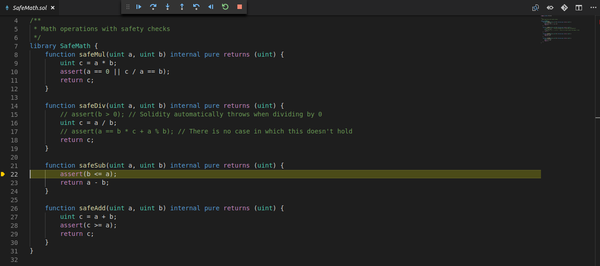

# Solitude Debug

Debug a committed transaction using solitude by passing the Transaction Id.

# Installation

- npm install --save
- npm run postinstall
- npm compile

# TO-DO

- Register breakpoints when the session starts
- Line Breakpoints
- Clear Breakpoints
- Exception handling
- Hierarchical call stack view (X)
- Handle end session messages
- Adapt Solitude session to Truffle project (library injection does not work)
- Red highlight when exception found on continue (active editor may on the same file)
- Add command for the REPL interface
- Clean decorations onStop event
- Handle stop session
- Change variables when change scope
- Evaluate the correct call stack on continue event (subtle for the intermediate states we don't know file, line and variables)
- Support restart
- Callstack format
- MultiOptions selection with transactions when activate
- List of valid transactions
- Add Description to the transactio id ( different sessions)
- First transaction does not work in e04 (check if a transaction works) -> solitude debugger code (debugger/evm_trace.py350 )
                    receipt = client.eth_getTransactionReceipt(transaction["hash"])
                    contract_address = receipt["contractAddress"]
                    if contract_address is not None:
- Refactor in exstension.ts (remove RPC calls logic)
- Refactor in runtime (decouple operation queue from runtime logic)
- Exstension.ts should handle all the possible errors
- Exstension exception  should show the red window with the message (atm the expcetion message is shown in the console)