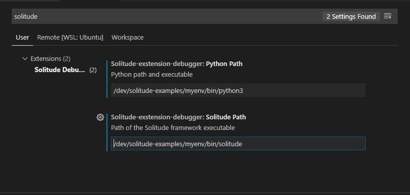
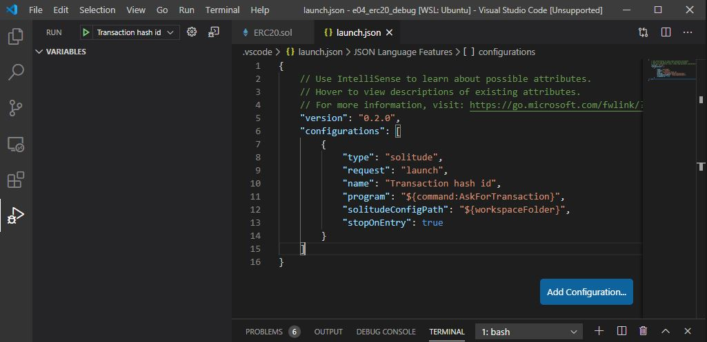
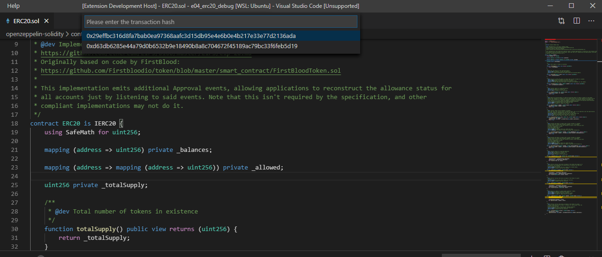

# Solitude Debug

#### Debug Transactions in Solitude with the VSCode Extension
*Note: For now only Linux and WLS are supported*

**This extension use the Solidity Framework please visit https://solitude-ethereum.xyz to know more**


You can debug a transaction using the [vscode solitude extension](https://marketplace.visualstudio.com/items?itemName=gmondelli.solitude-debug).

Let's install the `Solitude Debug` extension from the vscode marketplace or from the [website](https://marketplace.visualstudio.com/items?itemName=gmondelli.solitude-debug).

Let's clone the [Solitude Examples repository](https://github.com/incerto-crypto/solitude-examples) and make sure we have Solitude and its requirements installed:

Requirements on your OS:
- Python3.5 or greater
- node8 or greater
- yarn / npm

Create a python3 virtual environment and activate it. Install solitude.

```bash
python3 -mvenv myenv
source myenv/bin/activate
pip install git+https://github.com/incerto-crypto/solitude.git
```

Let's open the [solitude\_examples/e04\_cat\_shelter](https://github.com/incerto-crypto/solitude-examples/tree/master/examples/e04_erc20_debug) folder.
**It is important that the `solitude.yaml` is in the visual code workspace root or you might need to change the `solitudeConfigPath` field in the .vscode/lauch.json**

Remember to run `solitude install` and `solitude compile` to make sure you have the needed tools and the contracts compiled in the right folder as per the project [README](https://github.com/incerto-crypto/solitude-examples/blob/master/examples/e04_erc20_debug/README.md).

We need now to tell vscode the python and solitude executable path. We will use the one we have just created along with the new python virtual environment.

Open the VSCODE settings by pressing CTRL/CMD + SHIFT + p and select `Preferences: Open Settings UI`. In the search bar let's type Solitude and let's point the two fields to our executables. If we created the virtual environemtn in the dev folder the setting needs to look like it:



We navigate to the Debug vscode panel and we check we have a .vscode/launch.json file and a solitude configuration in it.



Before starting a debugging session we run the example script :
```bash
python token_launch.py
```

Finally we run the debugger pressing the green arrow `Transaction Hash Id` on the top left corner or pressing F5.

Visual code should prompt us with all the possible transaction we want to debug.



And we can now debug our transaction:


---
#### A little bit more about the script we are going to debug:

The contracts folder contain `MyToken.sol` which is an instance of an [ERC20](https://eips.ethereum.org/EIPS/eip-20)

```javascript
pragma solidity ^0.5.2;

import "./openzeppelin-solidity/contracts/token/ERC20/IERC20.sol";
import "./openzeppelin-solidity/contracts/token/ERC20/ERC20.sol";
import "./openzeppelin-solidity/contracts/token/ERC20/ERC20Mintable.sol";
import "./openzeppelin-solidity/contracts/token/ERC20/ERC20Detailed.sol";

contract MyToken is ERC20, ERC20Mintable, ERC20Detailed
{

  constructor(string memory _name, string memory _symbol, uint8 _decimals)
    ERC20Detailed(_name, _symbol, _decimals)
  public {

  }
}
```

From the python environment where we have installed solitude let's run the `token_launch.py`.
The script loads a config file and uses its options to run a server and create a client.
The client gets the reference of the compiled contracts `client by calling `update_contracts(factory.get_objectlist())` .

The `Project.ObjectDir` field in the `solitude.yaml` represents the path where the compiled contracts are stored after the compilation.
The [repository instructions](https://github.com/incerto-crypto/solitude-examples/blob/master/examples/e04_erc20_debug/README.md)
asks the user to invoke `solitude compile` to make sure the compiled contracts are available for this script to get the references.

```python
client = factory.create_client()
client.update_contracts(factory.get_objectlist())
owner = client.address(0)
george = client.address(1)
```

The script assigns aliases to address. The address at position 0 in the config `Server.Accounts` array is assigned to the alias `owner` and the address at position 1 to `george`.
The owner deploys the `MyToken` contract and `mint` 1000 tokens.

```javascript
function mint(address to, uint256 value) public onlyMinter returns (bool) {
    _mint(to, value);
    return true;
}
```
Note that the `mint` transaction method is inherited from the `ERC20Mintable` interface and can be run only from the contract's owner because of the `onlyMinter` modifier. This method creates new tokens and assign it to the owner of the contracts.
After minting and getting the token, the owner account tries to `transfer` 1000*10 tokens to `george`'s account, however he has only 1000 and the transaction fails.

```python
with client.account(owner):
    token = client.deploy("MyToken", args=("Token", "TKN", 0))
    txinfo = token.transact_sync("mint", owner, 1000)
    print_txinfo(txinfo)
    txinfo = token.transact_sync("transfer", george, 10000)
    print_txinfo(txinfo)
```

The script will execute three transactions:
- Contract deployment (ignored by this exstension): Successful
- Mint: Successful
- Transfer: Failed (not enough tokens)

Running the script we have the following output with the two (mint, transfer) transaction ids which are the same suggested by
the extension.

```bash
python token_launch.py

TX FROM 0x29c48A8FDeDc65cBe4019557de677bA48563f76d
   TO MyToken@0x749D167BB1A3FFdD6C21C8B75fa6958Bf327D51D
   FUNCTION mint('0x29c48A8FDeDc65cBe4019557de677bA48563f76d', 1000)
   TXHASH 0x29effbc316d8fa7bab0ea97368aafc3d15db95e4e6b0e4b217e33e77d2136ada

solitude.common.errors.TransactionError:transfer Transaction returned status 0. txhash: 0xd63db6285e44a79d0b6532b9e18490b8a8c704672f45189ac79bc33f6feb5d19

```

